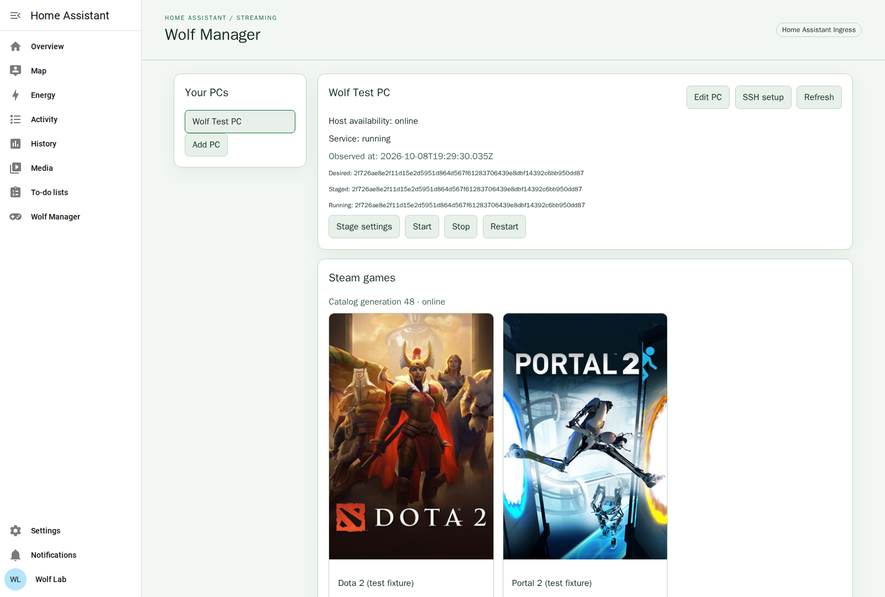

# HA Wolf Manager

> **⚠️ WARNING: AI-GENERATED, EXPERIMENTAL CODE**
>
> All original application code in this project was generated by AI coding
> agents through vibe coding. Tests and reviews do not guarantee that it is
> safe or correct. The host toolkit changes Wolf/Steam configuration and runs
> root-controlled installation and service operations. Keep independent backups
> of Steam saves/libraries, Wolf identity/pairings and manager state, and try a
> disposable installation before using it on important data. Upstream and
> vendored dependencies retain their own authorship and licenses.

Manage multiple [Wolf](https://github.com/games-on-whales/wolf) PCs from Home
Assistant or an authenticated standalone dashboard. The Rust manager connects
through restricted, host-key-pinned SSH. A separate Rust toolkit runs on each PC;
it does not require Ansible or a manager Docker socket.

Installation and runtime integration are experimental. Check the
[public releases](https://github.com/Ryther/ha-wolf-manager/releases): if none is
listed, there is no installable release yet. A draft, tag or green badge does not
mean that its image or archives are available. Use only a published release
whose checksums and provenance you have verified.

## Start here

The [documentation site](https://ryther.github.io/ha-wolf-manager/) is organized
by task. The same [guides are available on GitHub](docs/index.md). For a first setup:

1. [Choose a deployment](docs/guides/index.md): the
   [Home Assistant add-on](docs/guides/home-assistant.md) requires Supervisor;
   [standalone Docker](docs/guides/standalone.md) uses HTTPS and its own account.
2. [Prepare or adopt a Wolf PC](docs/guides/host-installation.md): preserve its
   existing data, review a local installer preview, then explicitly apply and
   activate the restricted toolkit.
3. [Enroll and observe the PC](docs/guides/operations.md#register-and-observe-a-pc):
   compare its SSH fingerprint independently, test the connection and refresh
   actual service/catalog status before changing settings.
4. [Operate games and controls](docs/guides/operations.md): save desired settings,
   explicitly stage/start/restart, and check operation outcomes. Use the discovered
   Wolf switch for Home Assistant automations and your existing voice setup.

Keep [backup and recovery](docs/guides/backup-recovery.md) available before an
upgrade or installation change. If setup or a control fails, start with
[troubleshooting](docs/guides/troubleshooting.md). The guides track this repository;
compare them with your installed version and its
[release notes](https://github.com/Ryther/ha-wolf-manager/releases).

## What to expect

- Home Assistant Ingress or standalone HTTPS with administrator authentication.
- Steam catalog entities and an observed Wolf ON/OFF switch through MQTT.
- Dashboard Start, Restart, Stop, settings revisions and bounded diagnostics.
- Per-game Direct launch, ordered reusable launch parameters, optional configured
  Proton-CachyOS, FSR4 settings and a diagnostic test ball.
- Previewed install/adopt, restricted SSH enrollment and bounded Wolf image refresh
  with cached-image fallback.
- Durable operation tracking and journal reconciliation after a lost reply.

Saving settings changes **Desired**, not a running session. A queued operation
is not a successful start. A stale last-known state is not evidence that a PC is
reachable. The controls manage the Wolf service; they do not power on a shut-down
PC or configure Google Home automatically.

This actual isolated HAOS capture shows the manager connected to a separate
Debian test PC. Its Steam catalog is synthetic. It demonstrates the control-plane
interface, not a GPU streaming session; see
[the interface evidence](docs/guides/home-assistant.md#verified-local-interface).

Owned runtime images are built from `scratch`, with native SSH, TLS, bootstrap
and health checks. They have no shell or runtime Node service. Wolf and game
containers are separate upstream components; the host's GPU/encoder setup must
already work independently.

## Compatibility evidence

| Distribution family | Container checks | Direct OS / GPU streaming |
| --- | --- | --- |
| Arch / CachyOS | Passed restricted SSH, sudo and offline unit checks | Not tested |
| Debian / Ubuntu LTS | Passed restricted SSH, sudo and offline unit checks | Debian VM: installer, systemd catalog and Wolf control plane passed; Ubuntu and GPU streaming not tested |
| Fedora | Passed restricted SSH, sudo and offline unit checks | Not tested |
| openSUSE Leap / Tumbleweed | Passed restricted SSH, sudo and offline unit checks | Not tested |

See [the platform test procedure](tests/host-platform/README.md) and its recorded
image digests. Containers do not prove systemd boot, hardware permissions,
SELinux behavior or streaming compatibility. The manager and host toolkit target
amd64 and arm64; the verified upstream Wolf stable image is currently amd64-only.
An ARM toolkit build does not establish an ARM Wolf deployment.

The [Home Assistant interface captures](docs/guides/home-assistant.md#verified-local-interface)
show actual Supervisor Ingress and MQTT discovery on an isolated HAOS VM.
Restricted SSH enrollment, settings staging and Wolf start/restart/stop were
exercised against a separate Debian VM with synthetic Steam catalog manifests.
See the [test matrix](docs/contracts/test-matrix.md) for source revisions,
coverage and remaining limits.

## Interface and version boundaries

The public [contracts](docs/contracts/schema.md) describe accepted configuration,
[SSH and MQTT](docs/contracts/integration-contract.md),
[API operations](docs/contracts/api-contract.md) and
[recovery](docs/contracts/recovery-contract.md). This is an experimental 0.x
project: review release notes for interface or deployment changes before updating.
Unsupported schemas and unsafe state must be refused rather than silently reset.
Keep old binaries/images and verified backups until the new installation is checked.

## Help and support

Start with [troubleshooting](docs/guides/troubleshooting.md). For a reproducible
problem, open a [GitHub issue](https://github.com/Ryther/ha-wolf-manager/issues)
with the manager/host versions, deployment mode, distribution/architecture,
observed status, operation ID and sanitized error codes. Do not share credentials,
private keys, game/library paths, raw MQTT/RPC payloads or recovery bundles.
Report suspected vulnerabilities through [SECURITY.md](SECURITY.md), rather than
posting exploit details publicly. There is no support-response or hardware
compatibility guarantee.

AI assistants can use the self-contained
[application-use skill](.agents/skills/ha-wolf-manager-guide/SKILL.md).
Codex and OpenCode use `.agents/skills/`; Claude follows the relative compatibility
link in `.claude/skills/`. The skill gives instructions, not server access or
permission to change an installation.

## Development and contribution

Read [CONTRIBUTING.md](CONTRIBUTING.md), [AGENTS.md](AGENTS.md) and the
[isolated development environment](docs/development/environment.md).
[Crate interfaces](docs/development/crate-contract.md),
[installation authority](docs/development/host-adapter-contract.md) and
[dependency sources](docs/development/dependencies.md) explain implementation
boundaries. Tests use disposable services and temporary state, never household
Home Assistant, Steam, Wolf or broker instances.

CI calls reusable Tests, CodeQL and Sonar workflows. PR analysis uses an isolated
Community server; trusted main uses SonarCloud. Release Please prepares coordinated
drafts, and the protected Release workflow independently verifies a completed CI
run before publishing its original tested bytes. Follow the
[release procedure](docs/guides/releases.md); source tests and badges alone do not
certify publication or complete security.

## License and credits

Original project code uses [MIT](LICENSE), copyright 2026 Ryther. Dependencies keep
their own licenses; the vendored MQTT crate retains [Apache 2.0](vendor/rumqttc/LICENSE).
[Wolf](https://github.com/games-on-whales/wolf) is maintained by Games on Whales;
this manager is independent and does not imply upstream endorsement.
Repository and documentation conventions reuse
[HAPatchY](https://github.com/Ryther/hapatchy) and
[UniFi AP Clients MQTT](https://github.com/Ryther/unifi-apclients-mqtt).
