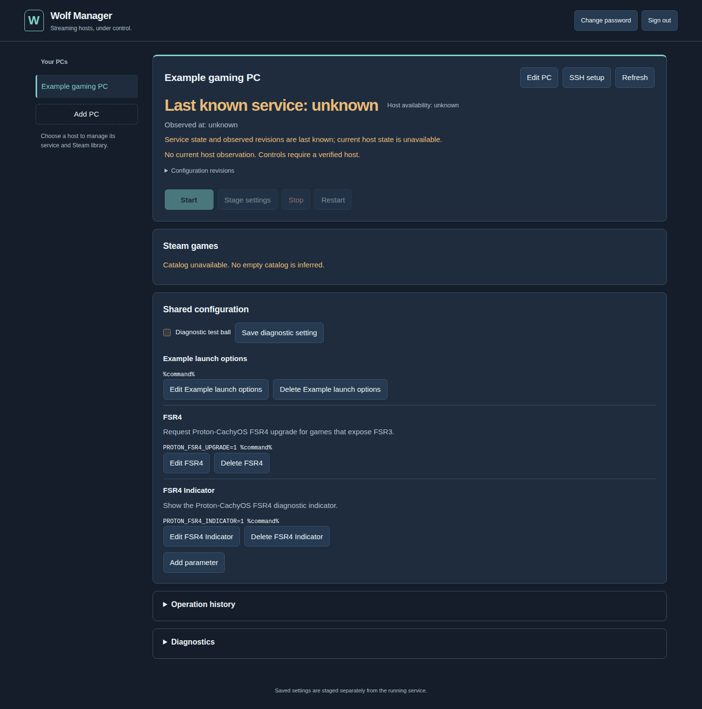

# Operate multiple Wolf PCs

[Documentation home](index.md) · [Troubleshooting](troubleshooting.md)

## Register and observe a PC

Choose **Add PC**, enter **PC ID**, **Display name**, **SSH host**, **SSH port**, and **SSH user**, then **Save PC**. Use the same PC ID as the host policy and catalog publisher. IDs are immutable lowercase identifiers (letters, digits, `_` and `-`, up to 64 characters). Use a distinct ID for each PC. Complete **SSH setup** as described in [host installation](host-installation.md).

**Refresh** reads host status and operation history. Check **Host availability** and **Observed at** together. An offline or unknown host shows **Last known service** and last-known revisions. Those values describe a previous observation, not its current running state. Different PCs can progress independently; mutations on one PC are serialized.

Actual native HTTPS runtime capture with synthetic PC metadata and no connected host: **Observed at: unknown** and the unavailable catalog are intentional. This image provides no evidence of a running Wolf session.

## Desired, staged and running

Expand **Configuration revisions** below the observed service status to compare all three values.

| Revision | Meaning | What changes it |
| --- | --- | --- |
| Desired | Manager's saved settings | Save game settings, shared parameters or diagnostic setting |
| Staged | Validated host-side override | Stage settings, or the staging part of Start/Restart |
| Running | Last verified effective Wolf configuration | Successful lifecycle application and observation |

Saving is not a restart. **Stage settings** uploads a validated override without changing active Steam settings. **Start** and **Restart** stage the desired revision before the lifecycle action. A staging failure leaves the existing service intact. Starting an already active service cannot silently apply a new revision: finish the gaming session and explicitly restart when you want the new settings applied. **Stop** restores tracked temporary Steam overlays; restoration failure is a recovery condition, not permission to overwrite backups.

A button's admission notice includes an operation ID. Expand and refresh **Operation history** to see its outcome. A queued or running operation is not success; a current ON state does not prove that a specific operation succeeded.

## Games and reusable parameters

The catalog comes from each PC's authorized Steam libraries. A missing game is not automatically uninstalled or deleted by the manager. Expand a game's **Game settings**, then use its **Direct launch** toggle, optional **Proton-CachyOS** toggle and **Reusable parameters** selector, then **Save game settings**. Proton-CachyOS is available only when the host policy grants an existing installation and the host reports that capability.

**Shared configuration** includes **Add parameter**, per-parameter editing/deletion and **Diagnostic test ball**. The test ball is a Wolf diagnostic application; it does not change log verbosity. The built-in **FSR4** parameter requests `PROTON_FSR4_UPGRADE=1 %command%`; **FSR4 Indicator** requests `PROTON_FSR4_INDICATOR=1 %command%`. Support still depends on the game, Proton build and GPU. These controls are not a claim of FSR4 compatibility on every system.

Custom launch options are stored as reusable templates. Include `%command%` where the game command belongs. Do not place credentials in game names, descriptions or launch options. Saving an edit changes desired settings; explicitly stage/start/restart afterwards.

## Handle an uncertain result

A timeout or manager restart can leave an operation `unknown_interrupted`. Do not repeatedly click Start/Restart. Select **Reconcile operation** in its history entry. The manager checks the exact recorded child request IDs and digests against the host journal. It does not infer success from today's service status and does not replay the mutation.

Read the displayed **Resolution** and partial-stage evidence. If the primary lifecycle request was never dispatched, successful staging alone is not successful startup. If journal evidence is missing, uncertainty remains and further conflicting mutations stay blocked. Preserve the journal and backups and follow [recovery](backup-recovery.md).
