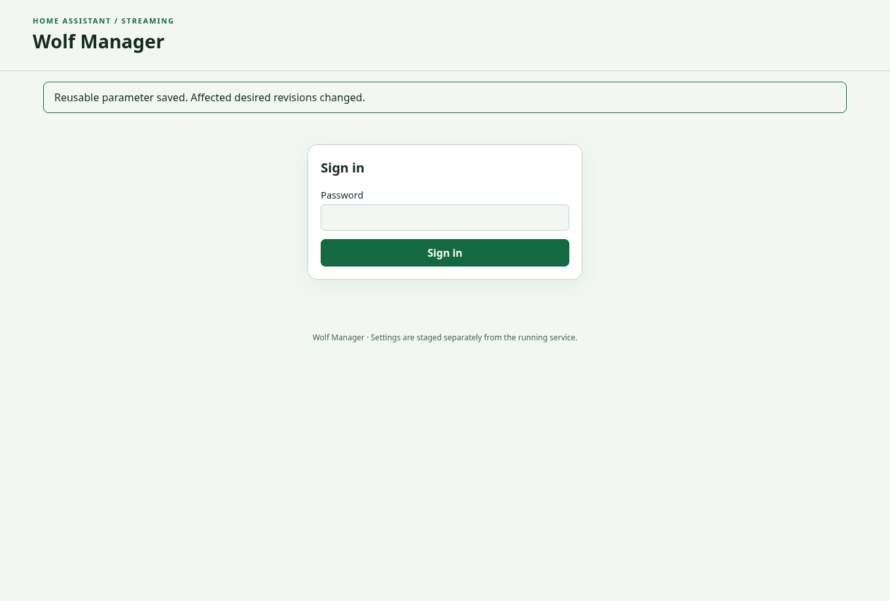

# Run the standalone HTTPS service

[Documentation home](index.md) · [Next: install a PC](host-installation.md)

## Prepare a private deployment directory

You need Docker with Compose, a verified manager image, a DNS name whose certificate your browser trusts, and connectivity from the manager to each PC's SSH port. The manager does not need a Docker socket or host privileges. The runtime image is built from scratch and has no shell or package manager.

Copy [compose.yaml](../../examples/standalone/compose.yaml), [.env.example](../../examples/standalone/.env.example) and [.gitignore](../../examples/standalone/.gitignore) to a new deployment directory. Copy `.env.example` to `.env`. Set `WOLF_MANAGER_IMAGE` to the verified release digest and `WOLF_PUBLIC_ORIGIN` to the exact HTTPS browser origin, including a non-default port. Replace the example hostname. Set a specific LAN bind address if other machines must connect; the default is loopback.

For a **new, empty** deployment directory:

```sh
umask 077
mkdir data secrets backups
sudo chown 1000:1000 data secrets backups
sudo chmod 700 data secrets backups
```

Do not recursively change an existing deployment's ownership. Preserve it and investigate mismatches before starting. This example runs as UID/GID 1000; protected state must belong to that identity.

Place your certificate chain in `secrets/tls-cert.pem` and private key in `secrets/tls-key.pem`. Create `secrets/bootstrap-token` with a freshly generated, unpredictable token using your password manager. Do not put credentials in `.env`, command arguments or Git. Make these three files regular files owned by UID 1000, mode `0600`; use `sudo install -o 1000 -g 1000 -m 600` from protected source files. Symlinks and hard links are rejected. Certificate files must also satisfy the protected-file checks.

```sh
docker compose config --quiet
docker compose up -d
docker compose ps
```

The image healthcheck uses the native `ha-wolf-manager healthcheck` command. A healthy container means operational readiness; it does not prove streaming compatibility. Open the configured HTTPS origin. **Create administrator** asks for the bootstrap token and a password of at least 12 bytes. Subsequent visits use **Sign in** with that password. Use **Change password** to rotate it. Bootstrap is single-use; retain the protected token file for startup configuration without treating it as a reusable login credential.



This is an actual browser capture against the isolated native HTTPS runtime, with synthetic account state. It does not show a household service.

## Connect an MQTT broker

The supplied example deliberately disables MQTT. To expose Home Assistant controls, remove `WOLF_MQTT_DISABLED` and add:

```yaml
environment:
  WOLF_MQTT_HOST: mqtt.example.net
  WOLF_MQTT_PORT: "8883"
  WOLF_MQTT_USERNAME: wolf-manager
  WOLF_MQTT_PASSWORD_FILE: /run/wolf-secrets/mqtt-password
  WOLF_MQTT_TLS: "true"
  WOLF_MQTT_CA_FILE: /run/wolf-secrets/mqtt-ca.pem
```

Merge these entries into the existing `environment` mapping. Provide the password and optional private CA as protected regular files, as above. Omit `WOLF_MQTT_CA_FILE` when the broker uses a publicly trusted certificate. Username and password-file must be supplied together. The manager requires a broker supporting MQTT v5. Match topic settings across the manager and all host publishers. See [Home Assistant and MQTT](home-assistant.md).

## Reverse proxy alternative

Native TLS is the default example. To terminate HTTPS at a trusted reverse proxy, remove **both** TLS file settings and provide `WOLF_TRUSTED_PROXY` with exact proxy IP addresses, comma-separated. Keep the public HTTPS origin. Bind the HTTP listener to a private interface and restrict it to those proxies. Native TLS and trusted-proxy mode are mutually exclusive. Forwarded headers do not establish trust unless the actual TCP peer is explicitly trusted. Do not use Home Assistant Ingress headers for standalone authentication.

Before changing the image, take a [verified backup](backup-recovery.md), record the old image digest and keep the old data intact. Pull the chosen digest explicitly and recreate the service. Do not roll an older executable over newer state without checking schema compatibility.
